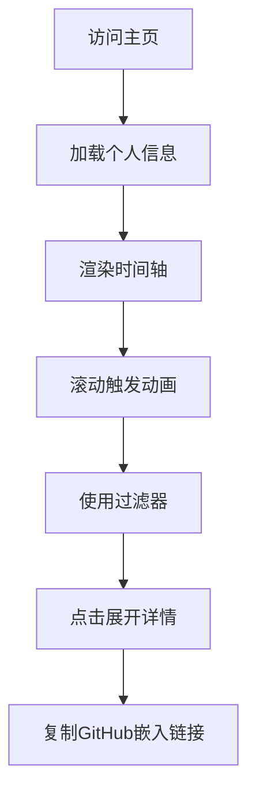

## 1. Product Overview

TimeFlux (个人时光流) 是一个现代化的个人时间轴展示工具，通过维护单一的YAML数据文件，自动生成精美的交互式个人履历网页，同时提供API接口生成实时SVG图片供GitHub README嵌入展示。

核心价值：解决个人品牌展示需求，让开发者、设计师、学生等群体能够以视觉吸引的方式展示教育背景、职业经历和项目成果，提升个人形象和专业度。

## 2. Core Features

### 2.1 User Roles

| Role          | Registration Method              | Core Permissions                             |
| ------------- | -------------------------------- | -------------------------------------------- |
| Visitor       | No registration required         | View timeline, filter events, expand details |
| Profile Owner | GitHub authentication (optional) | Edit YAML data, customize appearance         |

### 2.2 Feature Module

TimeFlux包含以下核心页面：

1. **个人时间轴主页**：展示完整的时间轴，包含个人简介、事件过滤、交互动画
2. **GitHub嵌入API**：动态生成SVG图片供GitHub README引用

### 2.3 Page Details

| Page Name      | Module Name    | Feature description                                             |
| -------------- | -------------- | --------------------------------------------------------------- |
| 个人时间轴主页 | 个人信息展示区 | 展示头像、姓名、简介，采用Bento Grid布局，支持深色/浅色模式切换 |
| 个人时间轴主页 | 时间轴容器     | 中央脊柱式设计，大屏幕左右交替排列，移动端左对齐单列显示        |
| 个人时间轴主页 | 事件卡片       | 显示事件标题、组织、日期、标签，支持点击展开详细描述            |
| 个人时间轴主页 | 动态连接线     | 滚动时连接线从上到下有颜色填充动画效果                          |
| 个人时间轴主页 | 过滤器胶囊     | 顶部悬浮按钮组，支持按类型筛选（全部/工作/教育/项目/奖项）      |
| 个人时间轴主页 | 视差动画       | 卡片进入视口时带轻微上浮和透明度变化的淡入效果                  |
| GitHub嵌入API  | SVG生成器      | 读取最新3-5条时间轴数据，生成适配GitHub主题的SVG图片            |

## 3. Core Process

用户访问流程：

1. 用户访问主页，看到个人信息头部和时间轴
2. 滚动页面触发连接线生长动画和卡片淡入效果
3. 点击顶部过滤器筛选特定类型的事件
4. 点击单个事件卡片展开查看详细信息
5. 用户可复制GitHub嵌入链接到个人README中

## 4. User Interface Design

### 4.1 Design Style

- **主色调**：Zinc色系（#09090b, #18181b, #27272a）营造现代极简氛围
- **强调色**：Indigo-500 (#6366f1) 用于时间轴连接点、重要按钮、链接
- **按钮样式**：圆角设计（rounded-xl），玻璃拟态效果（bg-white/5 backdrop-blur-md）
- **字体方案**：Geist Sans作为主要字体，代码片段使用Geist Mono
- **图标风格**：Lucide React图标库，线条简洁，风格统一
- **布局风格**：卡片式布局配合大量留白，增强视觉层次感

### 4.2 Page Design Overview

| Page Name      | Module Name  | UI Elements                                                                                                                                                             |
| -------------- | ------------ | ----------------------------------------------------------------------------------------------------------------------------------------------------------------------- |
| 个人时间轴主页 | 个人信息头部 | Bento Grid布局，包含头像（圆形，带发光边框）、姓名（大标题，粗体）、简介（次要文字色）、社交链接（图标按钮组）、深色模式切换（右上角）                                  |
| 个人时间轴主页 | 时间轴区域   | 中央垂直线（2px宽，默认灰色，滚动时渐变为Indigo），事件卡片左右交替排列，卡片间距充足（py-12），移动端改为左对齐                                                        |
| 个人时间轴主页 | 事件卡片     | Card组件包裹，圆角xl，轻微玻璃效果，包含组织Logo（左侧小圆图）、事件标题（粗体，indigo色）、组织名称（次要色）、日期（小字，muted色）、标签组（Badge组件，outline样式） |
| 个人时间轴主页 | 过滤器       | 顶部固定位置，胶囊按钮组（全部/工作/教育/项目/奖项），选中状态使用indigo背景，未选中为透明边框，点击时有layout动画                                                      |
| GitHub SVG     | 图片样式     | 类似代码编辑器界面，深色背景，显示最近里程碑事件，包含时间、标题、组织，适配GitHub的800px宽度                                                                           |

### 4.3 Responsiveness

- **桌面优先**：默认设计针对1440px以上屏幕优化
- **断点设计**：
  - 768px以下：时间轴改为左侧单列布局
  - 640px以下：个人信息头部改为垂直堆叠，减少字体大小
- **触摸优化**：移动端增大点击区域，卡片最小高度44px，过滤器按钮间距增加
- **性能考虑**：使用CSS容器查询确保组件级别响应式，减少JavaScript计算

### 4.4 Animation Specifications

- **连接线生长**：使用Framer Motion的useScroll，0-30%滚动进度时连接线从灰色(#6b7280)渐变到Indigo-500(#6366f1)
- **卡片入场**：初始状态opacity: 0, y: 40，进入视口后动画到opacity: 1, y: 0，持续0.6s，ease-out缓动
- **过滤器切换**：使用LayoutGroup实现卡片重新排列的流畅动画，持续时间0.3s
- **详情展开**：高度从auto到指定高度，透明度变化，配合旋转箭头图标
