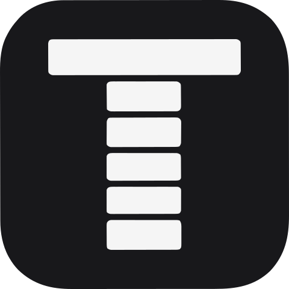

<div align="center">
  
  <h1>TimeFlux</h1>
  <p><b>Beautiful, YAML-driven personal timeline generator for developers.</b></p>

  <p>
    
    
    
    
    
  </p>

<a href="#-quick-start">Quick Start</a> •
<a href="#-deployment">Deployment</a> •
<a href="#-key-features">Features</a> •
<a href="#-data-configuration">Configuration</a> •
<a href="#-api-integration">API</a>

</div>

---

## 🌟 Introduction

**TimeFlux** is a modern, minimalist timeline generator designed for developers to showcase their professional journey, projects, and achievements. Just manage your career data in a simple YAML file, and TimeFlux handles the rest—delivering a high-performance, interactive, and visually stunning web experience.

## ✨ Key Features

- **📂 Data-First Architecture**: Your timeline is purely driven by a single `public/data.yaml` file. Easy to version control, edit, and share.
- **🎨 Minimalist Aesthetics**: A clean, "Zinc-style" UI inspired by high-end developer tools. Fully responsive and looks great on any device.
- **🌙 Native Dark Mode**: Seamlessly switches between light and dark themes with system preference detection.
- **🎭 Motion Experience**: Silky smooth "scroll-drawing" timeline lines and card entrance animations powered by **Framer Motion**.
- **✅ Schema Validation**: Built-in **Zod** validation ensures your YAML data is always correct before you deploy.
- **⚡ Performance Focused**: Built with Next.js 16 App Router and Biome for a blazing fast development and runtime experience.

## 🚀 Quick Start

### 1. Clone & Install

```bash
git clone https://github.com/zhiweio/timeflux.git
cd timeflux
pnpm install
```

### 2. Configure Your Data

Open `public/data.yaml` and add your information (see [Configuration](#-data-configuration) below).

### 3. Run Development Server

```bash
pnpm dev
```

Visit [http://localhost:3000](http://localhost:3000) to see your timeline in action!

---

## 🛠️ Deployment

### Deploy to Vercel

The easiest way to deploy your TimeFlux timeline is to use the [Vercel Platform](https://vercel.com/new?utm_medium=default-template&filter=next.js&utm_source=create-next-app&utm_campaign=create-next-app-readme).

[](https://vercel.com/new/clone?repository-url=https%3A%2F%2Fgithub.com%2Fzhiweio%2Ftimeflux)

#### 💻 CLI Deployment

If you prefer using the terminal, you can deploy using the [Vercel CLI](https://vercel.com/download):

1. **Install Vercel CLI**: `pnpm add -g vercel`
2. **Login**: `vercel login`
3. **Deploy**: `vercel`

#### 🔧 Configuration

TimeFlux is pre-configured for Vercel with a `vercel.json` file that follows official best practices:

- **Framework Detection**: Automatically detects Next.js.
- **Clean URLs**: Enabled for better SEO and user experience.
- **Cache Optimization**: Built-in Next.js caching works out of the box.

---

## 📖 Data Configuration

TimeFlux uses [Zod](https://zod.dev/) to validate your data. The core configuration resides in `public/data.yaml`.

### Schema Overview

```yaml
profile:
  name: "Alex Dev"
  avatar: "/avatar.png" # or URL
  bio: "Full Stack Developer"
  social:
    github: "https://github.com/alexdev"

timeline:
  - startDate: "2024-01-01"
    endDate: "2024-05-01" # Optional: End date if the event is ongoing
    title: "Senior Developer"
    type: "work" # work, internship, project, research, education, competition, award, certificate
    org: "Tech Corp"
    summary: "Led the core team..."
    description: |
      - Developed and maintained the company's main product, driving business growth.
      - Collaborated with cross-functional teams to deliver high-quality features.
    tags: ["React", "TypeScript"]
    images:
      - "https://github.com/zhiweio.png"
```

### Validate Your Data

Before committing, run the validation tool to catch errors:

```bash
pnpm validate
```

### 🧩 Tech Icons System

TimeFlux automatically maps your `tags` to technology icons.

- **Auto-Matching**: Tags like "React", "AWS", "Python" are automatically matched to their official icons.
- **Fuzzy Search**: Powered by **Orama** search engine to handle slight name variations.
- **Custom Aliases**: You can define custom mappings in `public/tech-alias.json`.
  ```json
  {
    "k8s": "kubernetes",
    "tf": "terraform"
  }
  ```

---

## 🔌 API Integration

You can fetch your timeline data in JSON format for integration with other services.

**Endpoint:** `GET /api/timeline`

| Parameter | Type     | Default | Description                |
| :-------- | :------- | :------ | :------------------------- |
| `count`   | `number` | `All`   | Number of items to display |
| `type`    | `string` | `All`   | Filter items by event type |

**Example:**
`https://your-domain.com/api/timeline?count=3&type=work`

---

## 🛠 Tech Stack

- **Framework**: [Next.js 16](https://nextjs.org/) (App Router)
- **Language**: [TypeScript](https://www.typescriptlang.org/)
- **Styling**: [Tailwind CSS 4](https://tailwindcss.com/)
- **Components**: [shadcn/ui](https://ui.shadcn.com/)
- **Animations**: [Framer Motion](https://www.framer.com/motion/)
- **Validation**: [Zod](https://zod.dev/)
- **Lint/Format**: [Biome](https://biomejs.dev/) & [Prettier](https://prettier.io/)

---

## 🤝 Contributing

Contributions are what make the open source community such an amazing place to learn, inspire, and create. Any contributions you make are **greatly appreciated**.

1. Fork the Project
2. Create your Feature Branch (`git checkout -b feature/AmazingFeature`)
3. Commit your Changes (`git commit -m 'Add some AmazingFeature'`)
4. Push to the Branch (`git push origin feature/AmazingFeature`)
5. Open a Pull Request

---

## 📜 License

Distributed under the MIT License. See [LICENSE](./LICENSE) for more information.

---

<div align="center">
  Built with ❤️ by <a href="https://github.com/zhiweio">zhiweio</a>
</div>
